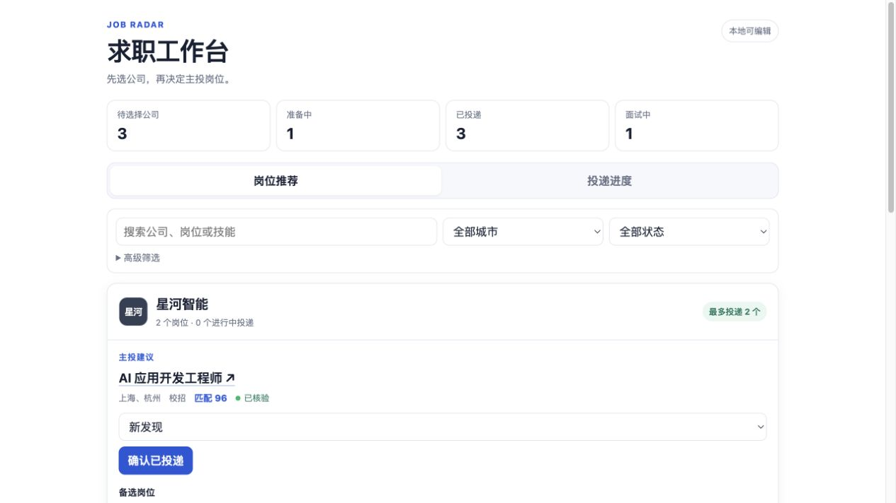
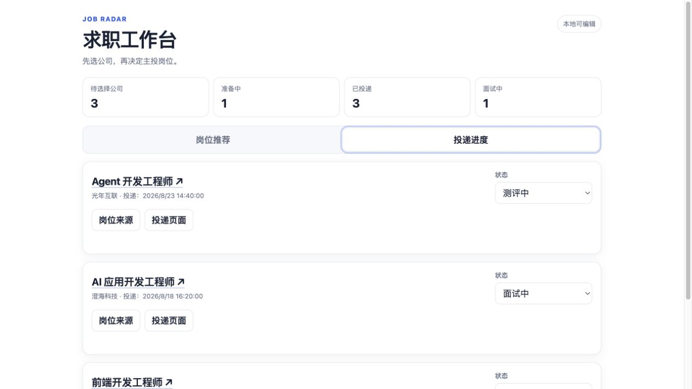

<h1 align="center">Job Radar</h1>

<p align="center">
  A local-first Codex skill that discovers Mainland China job openings,<br />
  explains why they match, and keeps every application status under your control.
</p>

<p align="center">
  <a href="https://github.com/guiyangyuan/job-radar/actions/workflows/test.yml"></a>
  
  
  <a href="LICENSE"></a>
</p>

<p align="center">
  
</p>

<p align="center"><sub>Real Job Radar UI with fully synthetic companies, roles, and application data.</sub></p>

## Why Job Radar?

Job hunting usually splits into two disconnected problems: finding roles that are actually open, and remembering what happened after clicking Apply. Job Radar connects both without uploading your resume or application history to another service.

- **Find current roles** from employer career pages and other public Mainland China recruitment sources.
- **Keep useful links** by distinguishing an exact job detail page, an application flow, a searchable listing, and a generic careers homepage.
- **Choose one primary role per company** with at most two alternatives, instead of flooding the dashboard with near-duplicates.
- **Respect application limits** when an official company source publishes a quota or role-change rule.
- **Track the real funnel** from applied and assessment through interview, offer, rejection, withdrawal, and archive.
- **Keep personal data local** in explicit JSON files that remain outside the installed skill and outside Git.

## Dashboard

### Company-first recommendations

Each company gets one primary recommendation, up to two alternatives, a direct destination label, and an explicit application-limit badge. Unknown rules stay unknown instead of being inferred from forum posts.

### Status-only application tracking

The application view intentionally keeps editing simple: open the original job or application page, then update the current status from the dropdown. Rejection is a first-class status rather than a hidden archive action.

<p align="center">
  
</p>

## How it works

```mermaid
flowchart LR
    A["Resume or onboarding answers"] --> B["Confirmed privacy-safe profile"]
    B --> C["Current public job sources"]
    C --> D["Normalize, verify, and deduplicate"]
    D --> E["Explainable matching and company grouping"]
    E --> F["Local recommendation dashboard"]
    F -->|"User confirms application"| G["Local application record"]
    G --> H["Assessment / Interview / Offer / Rejected"]
```



Codex handles resume interpretation and current web discovery. The bundled Python runtime provides deterministic schemas, source precedence, link classification, deduplication, scoring, storage, history, privacy export, and the local dashboard.

## 30-second start

### 1. Install the skill

```bash
git clone https://github.com/guiyangyuan/job-radar.git
mkdir -p ~/.codex/skills
cp -R job-radar/job-radar ~/.codex/skills/job-radar
```

Restart Codex so the new skill is discovered. Job Radar requires Python 3.11 or newer and has no third-party Python dependencies.

### 2. Build a profile

Attach a resume or answer the guided questions:

```text
Use $job-radar to build my job-search profile from this resume.
```

Job Radar removes contact details and full resume passages before saving the structured profile. It requires confirmation before recommending roles.

### 3. Find jobs

```text
Use $job-radar to find current campus roles for AI application,
AI full-stack, Agent, and frontend development in Mainland China.
```

The result is written to a local workspace such as `./job-radar-data`, with source evidence and last-verification timestamps preserved.

### 4. Open the dashboard

```text
Use $job-radar to open my application dashboard.
```

Or run the deterministic CLI directly:

```bash
python3 ~/.codex/skills/job-radar/scripts/job_radar.py serve \
  --workspace ./job-radar-data
```

The editable service binds only to `127.0.0.1` and opens a tokenized local URL.

## Example prompts

```text
Use $job-radar to refresh my job pool and show only newly verified roles.

I submitted the application for JOB_ID. Record it as applied.

The company invited me to a technical interview. Update the application status.

Export a read-only privacy-safe snapshot of my current progress.
```

Job Radar treats visiting an application page as navigation only. It creates an application record only after the user explicitly confirms submission.

## Matching and evidence

The configurable score totals 100 points:

| Signal | Default | What is measured |
| --- | ---: | --- |
| Role | 30 | Target role and alias overlap |
| Skills | 30 | Required skills supported by visible job evidence |
| Eligibility | 15 | Recruitment type, experience, education, and graduation window |
| Location | 10 | City and remote-preference match |
| Preference | 10 | Preferred industry and company type |
| Freshness | 5 | Publication and verification recency |

Missing evidence never receives full credit. Expired jobs and strict hard-filter mismatches are filtered rather than quietly ranked lower.

Source precedence is intentionally conservative:

1. Employer career pages
2. NCSS and Guopin
3. Nowcoder, Shixiseng, and public university career centers
4. Other public link-level discovery sources, followed to an employer page when possible

Search snippets alone never establish that a role is active or that a URL is an exact job-detail page.

## Local data model

```text
job-radar-data/
├── profile.json             # confirmed search preferences
├── jobs.json                # normalized and scored job pool
├── applications.json        # user-confirmed application states
├── company-policies.json    # verified quotas and role-change rules
├── settings.json
├── backups/                 # bounded canonical backups
└── exports/                 # privacy-filtered HTML snapshots
```

The workspace is separate from the installed skill. The repository ignores `job-radar-data/`, backups, exports, temporary files, and Python caches.

## Privacy and safety boundaries

- Never stores credentials, cookies, MFA codes, identity numbers, personal email addresses, phone numbers, exact addresses, or full resume text.
- Never submits an application or claims that one was submitted.
- Never bypasses login, CAPTCHA, MFA, robots rules, rate limits, or anti-automation controls.
- Never invents deadlines, eligibility rules, salaries, locations, job IDs, or application URLs.
- Never advances an application stage without explicit user confirmation or user-provided evidence.
- Removes notes, evidence links, and their history copies from privacy exports.
- Rejects non-loopback dashboard binding, malformed JSON, unsafe URLs, stale writes, and oversized request bodies.

See [`job-radar/SKILL.md`](job-radar/SKILL.md) for the complete agent workflow and [`job-radar/references/source-policy.md`](job-radar/references/source-policy.md) for source classification rules.

## CLI reference

| Command | Purpose |
| --- | --- |
| `init` | Create canonical local files and bounded backup/export folders |
| `validate` | Validate versions, fields, URLs, dates, statuses, and score weights |
| `merge-jobs` | Deduplicate normalized job JSON and apply source precedence |
| `migrate-links` | Conservatively classify legacy job destinations |
| `merge-policies` | Merge official company application rules |
| `score` | Apply hard filters and the explainable six-part score |
| `apply` | Record a user-confirmed application |
| `update` | Change an application and append an auditable history event |
| `serve` | Run the token-protected loopback dashboard |
| `export` | Generate a self-contained read-only HTML snapshot |
| `summary` | Summarize job-pool and application states |

Run `python3 job-radar/scripts/job_radar.py --help` for all options.

## Repository structure

```text
job-radar/
├── README.md
├── docs/assets/                 # synthetic dashboard screenshots
└── job-radar/
    ├── SKILL.md                    # Codex workflow and boundaries
    ├── agents/openai.yaml          # skill-list metadata
    ├── assets/dashboard-template.html
    ├── references/                 # schemas and source policy
    ├── scripts/job_radar.py        # standard-library CLI
    ├── scripts/job_radar_lib/      # deterministic domain modules
    └── tests/                      # unit and integration coverage
```

## Development

Run the same suite used by GitHub Actions:

```bash
PYTHONPATH=job-radar/scripts \
  python3 -m unittest discover -s job-radar/tests -t job-radar -v
```

The current suite contains **103 tests** covering schemas, scoring, source precedence, links, company grouping, application history, privacy exports, dashboard rendering, and loopback-server security.

## License

[MIT](LICENSE) © 2026 Guiyang Yuan
